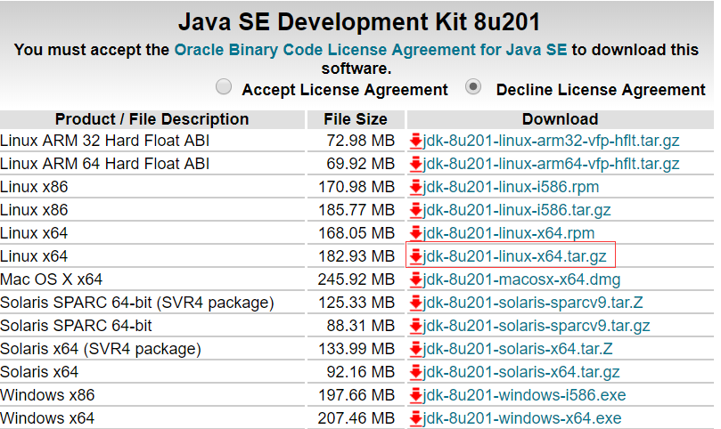
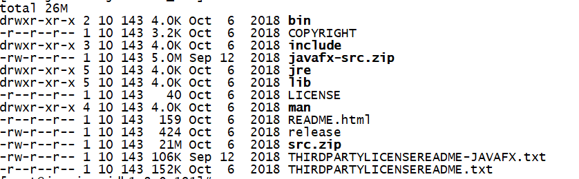
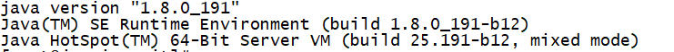

操作系统平台：Linux

打开oracle官网下载地址


使用wget下载
 wget  https://download.oracle.com/otn-pub/java/jdk/8u201-b09/42970487e3af4f5aa5bca3f542482c60/jdk-8u201-linux-x64.tar.gz

解压即可
tar  zxvf  jdk-8u201-linux-x64.tar.gz

目录结构如下
<<<<<<< HEAD

=======

>>>>>>> fbd4c3910b0cb81dc11093b7d64735d8d19fa555

配置环境变量

```shell
vim  ~/.bash_profile
```

```shell
export  JAVA_HOME=/usr/java/jdk1.8.0_201
export  PATH=$PATH:$JAVA_HOME/bin
```

使配置生效

```shell
source  ~/.bash_profile
```

查看Jdk安装是否正常

```shell
java  -version
```

若显示如下 说明安装成功


