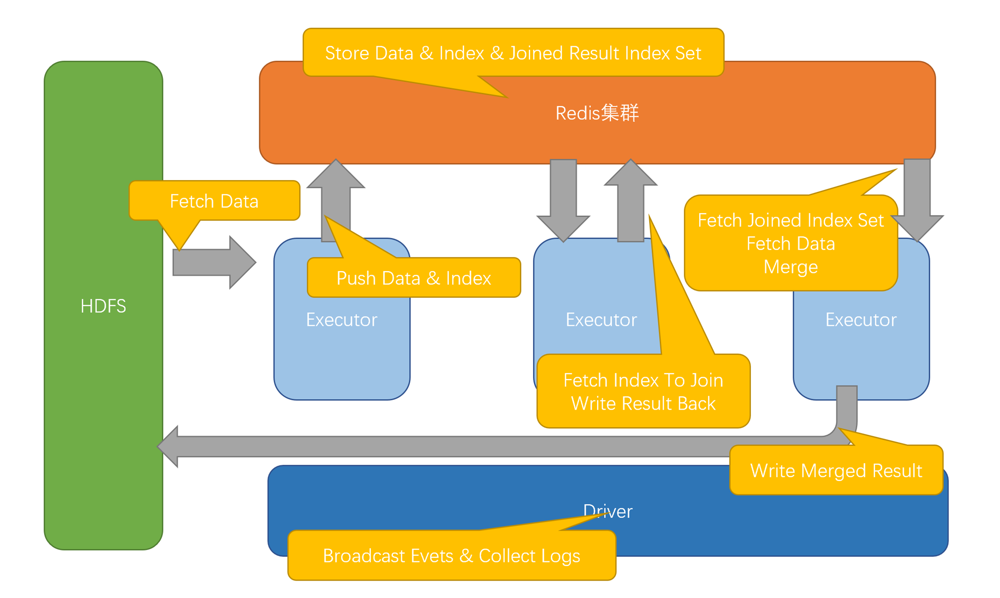
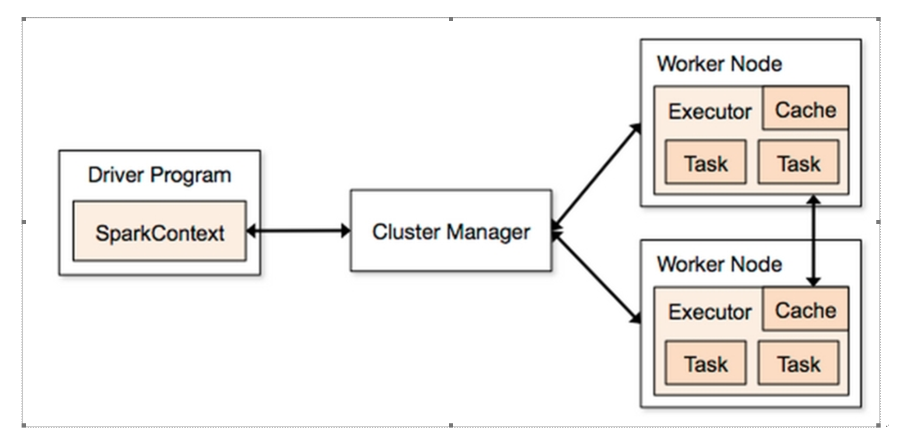

# N-INSIGHT-EVENT系统用户手册

# 1.  文档说明

## 1.1  阅读对象

本手册是N-INSIGHT-EVENT系统的操作手册。它指导读者如何正确对N-INSIGHT-EVENT系统进行使用，平台数据进行配置，以及使用过程中的注意事项。

本手册面向的主要对象是N-INSIGHT-EVENT系统管理员及维护人员。

## 1.2  缩略语

 

## 1.3  文档组织结构

第一章（即本章）对本文档的阅读对象、缩略语以及文档组织结构进行了说明。

第二章介绍了系统的结构、拓扑以及运行环境。

第三章对N-INSIGHT-EVENT子系统的使用进行了详细的阐述。

第四章对N-INSIGHT-EVENT子系统的使用进行了详细的阐述。

## 1.4  使用说明

本章讲述了N-INSIGHT-EVENT系统的各个子模块的使用说明。

【注意】的意思是请读者注意的一些事项。

【警告】的意思是请读者千万注意某些事项，否则将造成错误。

 

# 2.  系统简介

## 2.1  系统构成

图2-1      系统架构图

## 2.2  运行环境 

图2-2 N-Insight网络拓扑图

### **2.2.1**  **硬件环境**

N-Insight运行在大数据环境外的客户端节点，由于Spark Driver程序一般都运行在该节点，所以硬件的配置与专题的复杂度相关，一般情况下需要64G内存，16线程CPU。

### **2.2.2**  **软件环境**

表 2-1 系统运行的软件环境

| 编号 | 软件         | 功能                              |
| ---- | ------------ | --------------------------------- |
| 1    | Jdk1.8       | Java运行环境。                    |
| 2    | Postgres sql | 用于存储N-Insight执行计划等数据。 |

 

# 3.  系统使用说明

### 3.1.执行计划

#### 3.1.1基础参数设置和数据源选择

- **基础参数设置->计划标题**：执行的专题计划的名称，标题名可以重复。
- **数据源选择->Spark Runtime**: 这个是在工具箱配置文件etc/Toolbox/datasource.properties配置的。意思为本次专题执行要读取的数据源。
- **数据源选择->green结果库**:这个是在工具箱配置文件etc/Toolbox/datasource.properties配置的。意思为本次专题执行结果输出到关系型gp库。
- **数据源选择->hive结果库**:这个是在工具箱配置文件etc/Toolbox/datasource.properties配置的。意思为本次专题执行结果输出到hive库。当然也可以把本次专题的执行结果输出到hdfs上。
- **数据源选择->hdfs结果库**:这个需要在工具箱配置文件etc/Toolbox/datasource.properties配置的。意思为本次专题执行结果输出到hdfs上。

#### 3.1.2 执行方式和报告消息

执行方式分为：(1)立即执行，(2)指定时间执行，(3)周期性执行，(4)按消息触发

- **立即执行**：配置好本计划之后，点击提交，本计划将会立即执行。
- **指定时间执行**：配置一个执行计划开始时间,点击提交,该执行计划会在你指定的时间开始执行。

- **周期性执行**：配置执行计划开始时间和执行计划结束时间。周期执行的重复类别分为：每1分钟，每5分钟，每10分钟，每15分钟，每30分钟，每小时，每天，每周，每月。当配置好重复类别后，该执行计划会在计划开始时间到计划结束时间这段时间内周期性执行该计划。

- **按消息触发**：如果执行计划需要依赖其他专题的执行结果(如下图所示)来判断是否触发此次专题执行计划的执行,那么就需要配置按消息触发的执行方式。

报告消息分为：(1)发送到系统队列，(2)发送到自定义队列，(3)不发送

- **发送到系统队列**：一般用于检测数据源的完整性，如在nifi入库完成后或单独开发的定时扫描插件符合条件时，向N-Insight的 消息中心发送消息，消息的地址为N-Insight所在主机及端口，例： tcp://toolbox:61616 。消息队列名称为： com.nsn.message.driver 。消息格式如下：

**event**：消息的名称。按消息运行的专题需要指定依赖消息的名称。

**start和end**：检测数据的时段。格式依数据源的粒度为准，如数据粒度为年，格式则为 yyyy ；数据粒度为月，格式 则为 yyyymm ；数据粒度为天，格式则为 yyyymmdd ；数据粒度为小时，格式则为 yyyymmddhh ；数据粒度为分钟， 格式则为 yyyymmddhhmm ；

**type**：消息的粒度。有以下几种类型： EVENT：事件消息。依赖该类型的专题收到消息后会立即执行 MINUTELY：分钟粒度。 MIN5LY：5分钟粒度。 MIN10LY：10分钟粒度。MIN30LY：30分钟粒度。 HOURLY：小时粒度。 DAYLY：天粒度。 WEEKLY：周粒度。 MONTHLY：月粒度。 YEARLY：年粒度。

- **发送到自定义队列**：和发送到系统队列一样，只是队列是自己自定义的，如果你的专题没有被其他专题所依赖，那么选择不发送。 

#### 3.1.3专题参数设置

起止时间：专题执行计划要计算某个时间段内的数据

Spark执行选项：spark运行时参数列表。例如：--master yarn  --driver-memory 6g --driver-cores 2 --conf spark.sql.shuffle.partitions=30 --executor-memory 6g --executor-cores 4 --num-executors 15

专题调测：默认是不调测

### 3.2历史报告

历史报告显示的是该专题的执行计划已经执行的历史报告次数以及每次执行之后的详细信息。

例如：该计划是否执行成功，该计划的起始时间，完成时间，运行耗时等详细信息。

后面的按钮为再次执行该计划，查看该执行计划的日志，以及删除该历史执行报告。

### 3.3已有计划

已有计划表示已为该专题配置了几个执行计划，以及该执行计划的详细信息。例如：该计划的执行方式哪种,是立即执行、按指定时间执行、还是周期性执行。该计划是执行一次还是重复性执行。该计划是否向消息队列发送消息等。

立即执行：点击该按钮，该计划立即执行，参数为你所配置的spark运行时参数列表。删除为你可以删除该执行计划。
