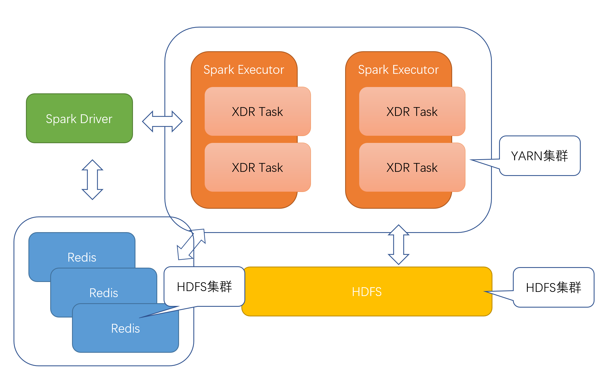

# N-INSIGHT-EVENT系统安装手册

[TOC]

# 1.  文档说明

## 1.1  阅读对象

本手册是N-INSIGHT-EVENT系统的安装手册。它指导读者如何正确对N-INSIGHT-EVENT系统进行安装，平台数据进行配置，以及使用过程中的注意事项。

本手册面向的主要对象是N-INSIGHT-EVENT系统管理员及维护人员。也可以为N-INSIGHT-EVENT系统的安装调试工程师提供指导。

## 1.2  缩略语

| 术语     | 解释                                                         |
| -------- | ------------------------------------------------------------ |
| partition      | 任务的并发度                       |
 

## 1.3  文档组织结构

第一章（即本章）对本文档的阅读对象、缩略语以及文档组织结构进行了说明。

第二章介绍了系统的结构、拓扑以及安装的基本顺序。

第三章详细的阐述了系统的安装步骤以及参数配置过程。

# 2.  系统介绍

## 2.1  系统构成




N-INSIGHT-EVENT使用Java/Scala语言开发，基于Spark平台，提供一套通用的大数据平台合成框架，各个项目上可以使用自己的业务插件

### 2.1.1  常用插件列表

- com.nsn.compact: 对象压缩算法插件，提升效率
- com.nsn.kv：redis集群访问插件。
- com.nsn.redis：自研java版本redis，解决项目现场无法提供redis的情况。
- com.nsn.redis.spark：自研基于spark的redis集群版本。
- com.nsn.state：合成状态机。
- com.nsn.xdrcomposer.plan：大数据合成执行计划。
- com.nsn.xdrcomposer.spark：大数据合成spark定制框架。
- com.nsn.io：I/O工具插件
- com.nsn.logger：日志工具插件。


## 2.2    拓朴结构


## 2.3    软件部署

将目录下deploy包内的所有文件复制到客户机下，以下所有安装的软件统一安装到指定目录，创建指定目录如下所示：

```shell
mkdir /opt/do   
```

注：该平台所有安装的软件都安装在/opt/do
注：确保/opt/do/deploy路径正确
 

## 2.4    安装包介绍

N-INSIGHT-EVENT安装主要包括以下几部分： 

- Libs文件夹内包含本项目依赖的第三方jar包
- Plugins文件夹内包含本项目合成算法包
- spark_redis.py 大数据环境下redis启动脚本
- spark_composer.py 大数据环境下合成系统启动脚本


# 3.  系统安装

## 3.1  安装准备

确保客户集群上包括必要的中间件与平台

- hadoop-2.7.3
- spark-2.1.3
- python-2.7

## 3.2  启动redis集群

若客户环境不存在redis集群，需要启动本项目自带的基于spark的redis集群

启动脚本：

```shell
python spark_redis.py
```

### 3.2.1  参数配置

python启动脚本关键部分如下：

doHome = "/opt/do"         #项目路径，deploy文件夹的父目录

spark-submit \

    --class com.nsn.redis.spark.Main \
    
    --master yarn \
    
    --deploy-mode client \
    
    --conf spark.ui.enabled=false \
    
    --driver-memory 1g \
    
    --executor-memory 1g \	#根据需要配置，一般5G
    
    --num-executors 2 \	#根据需要配置，需要启动几个实例就是几
    
    --executor-cores 1 \	#必须为1
    
    --queue default \	#根据项目情况改queue
    
    --jars %s/deploy/plugins/com.nsn.redis.jar \
    
    %s/deploy/plugins/com.nsn.redis.spark.jar \
    
    2			#需要与实例个数保持一致


### 3.2.3  验证

启动成功后，driver会打印出类似如下信息：

> INFO 2019-02-21 00:42:37 > Split 6, # Info, memory: 0, memory_human: 0B, jvm_used: 477.18MB, host: 10.159.145.156, port: 15304, keys: 0, handled: 1, alive: 7h6m46s, pid: 48478, conn: 0, busi: 0.02, Node: 32, Conf: 10.159.144.192:49136,10.159.145.71:11460,10.159.144.192:20136,10.159.145.158:20341

这是redis节点向Driver上报自己的信息，其中conf后面的是所有已上报redis的ip/port信息


## 3.3  N-INSIGHT-EVENT安装

### 3.3.1  启动脚本

进入/opt/do/deploy

```shell
python spark_composer.py
```

### 3.3.2    配置信息

脚本中的关键配置信息

```properties
doHome = "/opt/do"	// DO项目根路径
javaBin = ""	// java可执行程序的路径
hadoopConfDir = ""	// hadoop conf文件夹
sparkHome = ""	// spark的安装路径
queue = "default"	// yarn任务的queue
clazz = ""		// 要执行的合成算法
driverMemory = "8G"  // driver内存
executorMemory = "10m"  // executor内存
numExecutors = 2  // executor个数
executorCores = 2  // executor核心数
```

```properties
XDR_PARTITION: // 系统的分区数
XDR_MAX_ROUND: // 系统执行最大轮数，0为执行到结束，调试用
XDR_REDIS_URLS: // redis的ip和端口信息，用逗号分隔
XDR_REDIS_PASSWORD: // redis的密码，没有为空
XDR_MW_PATH: // 源数据的路径
XDR_MW_PATTERN: // 源数据的正则表达式，例如(.*)(.*)
XDR_GM_PATH: // 源数据的路径
XDR_GM_PATTERN: // 源数据的正则表达式
XDR_SV_PATH: // 源数据的路径
XDR_SV_PATTERN: // 源数据的正则表达式
XDR_RX_PATH: // 源数据的路径
XDR_RX_PATTERN: // 源数据的正则表达式
XDR_S1MME_PATH: // 源数据的路径
XDR_S1MME_PATTERN: // 源数据的正则表达式
XDR_SCAN_FILE_RATIO: // 每次扫描多大比例的文件
XDR_SCAN_BLOCK_SIZE: // 文件按多大分块，默认128M不用改
XDR_PUSH_COUNT_BATCH: // 每一批push多少数据
XDR_MEMORY_LIMIT: // push到多大内存量时停止
XDR_MERGE_BATCH: // 每次拉下多少堆数据进行merge
XDR_BUSI_CATCH_TIME: // 合成算法中的参数，一般为0
XDR_SYS_CATCH_TIME: // 合成算法中的参数，一般为0
XDR_BUSI_KEEP_TIME: // 合成算法中的参数，一般为30
XDR_SYS_KEEP_TIME: // 合成算法中的参数，一般为0
XDR_CLEAN_TIMEOUT: // 数据最大经过多长时间后清空，单位m
XDR_WRITE_SRVCC_PATH: // 结果写回hdfs的路径
XDR_WRITE_DROPS1MME_PATH: // 结果写回hdfs的路径
XDR_WRITE_FILE_SPAN: // 多长时间的结果保存为一个文件
XDR_WRITE_FILE_CACHE: // 最多缓存几个文件
```


### 3.4    停止服务

通过yarn客户端停止

```shell
yarn application -kill <appid>
```


