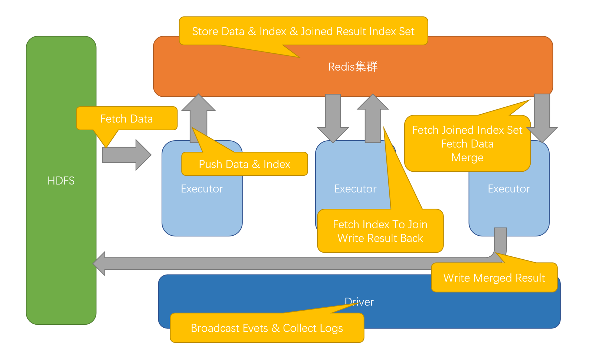

# N-INSIGHT-EVENT-系统用户手册

# 1.  文档说明

## 1.1  阅读对象

本手册是N-INSIGHT-EVENT系统的操作手册。它指导读者如何正确对N-INSIGHT-EVENT系统进行使用，平台数据进行配置，以及使用过程中的注意事项。

本手册面向的主要对象是N-INSIGHT-EVENT系统管理员及维护人员。

## 1.2  缩略语

 

## 1.3  文档组织结构

第一章（即本章）对本文档的阅读对象、缩略语以及文档组织结构进行了说明。

第二章介绍了系统的结构、拓扑以及运行环境。

第三章对N-INSIGHT-EVENT子系统的使用进行了详细的阐述。

第四章对N-INSIGHT-EVENT子系统的使用进行了详细的阐述。

## 1.4  使用说明

本章讲述了N-INSIGHT-EVENT系统的各个子模块的使用说明。

【注意】的意思是请读者注意的一些事项。

【警告】的意思是请读者千万注意某些事项，否则将造成错误。

 

# 2.  系统简介

## 2.1  系统构成

图2-1 N-INSIGHT-EVENT系统架构图

系统分为两部分：

1. redis集群：负责存储合成过程中用到的数据，包括：

    原始数据
  
    索引数据
  
    Join关联得到的临时数据
  
    系统运行时需要的公共数据、分布式原子量等
  
2. 基于Spark的合成应用，过程包括

    Fetch：从HDFS读取数据，解析为业务对象
 
    Push：将业务对象根据业务模型的需要提取索引，将对象和索引存入redis
 
    Join：从redis拉取索引，计算索引交集，将结果存入redis
 
    Merge：从redis拉取索引交集，根据交集拉取业务对象，将业务对象集合灌入合成算法模块中，获取合成结果
 
    Write：将合成结果写回HDFS

## 2.2  运行环境 

由于整个系统运行在spark上，因此与spark的拓扑一样

图2-2 N-INSIGHT-EVENT网络拓扑图

### **2.2.1**  **硬件环境**

N-INSIGHT-EVENT运行在大数据环境中，根据数据量的大小对硬件资源的需求会有不同

### **2.2.2**  **软件环境**

表 2-1 系统运行的软件环境

| 编号 | 软件          | 功能                              |
| ---- | ------------ | --------------------------------- |
| 1    | Hadoop-2.7.3 | 文件存储，资源调度。                |
| 2    | Spark-2.1.3  | 计算引擎。                         |
| 3    | Redis        | 对象索引缓存                       |
 

# 3.  系统使用说明

### 3.1.总体流程

1. 首先启动redis集群

2. 配置spark启动参数与系统运行参数

3. 使用标准spark-submit命令启动主程序

4. 观察带有MESSAGE标记的日志，判断应用是否正常

#### 3.2.启动脚本配置

- XDR_PARTITION: // 系统的分区数

- XDR_MAX_ROUND: // 系统执行最大轮数，0为执行到结束，调试用

- XDR_REDIS_URLS: // redis的ip和端口信息，用逗号分隔

- XDR_REDIS_PASSWORD: // redis的密码，没有为空

- XDR_MW_PATH: // 源数据的路径

- XDR_MW_PATTERN: // 源数据的正则表达式，例如(.*)(.*)

- XDR_GM_PATH: // 源数据的路径

- XDR_GM_PATTERN: // 源数据的正则表达式

- XDR_SV_PATH: // 源数据的路径

- XDR_SV_PATTERN: // 源数据的正则表达式

- XDR_RX_PATH: // 源数据的路径

- XDR_RX_PATTERN: // 源数据的正则表达式

- XDR_S1MME_PATH: // 源数据的路径

- XDR_S1MME_PATTERN: // 源数据的正则表达式

- XDR_SCAN_FILE_RATIO: // 每次扫描多大比例的文件

- XDR_SCAN_BLOCK_SIZE: // 文件按多大分块，默认128M不用改

- XDR_PUSH_COUNT_BATCH: // 每一批push多少数据

- XDR_MEMORY_LIMIT: // push到多大内存量时停止

- XDR_MERGE_BATCH: // 每次拉下多少堆数据进行merge

- XDR_BUSI_CATCH_TIME: // 合成算法中的参数，一般为0

- XDR_SYS_CATCH_TIME: // 合成算法中的参数，一般为0

- XDR_BUSI_KEEP_TIME: // 合成算法中的参数，一般为30

- XDR_SYS_KEEP_TIME: // 合成算法中的参数，一般为0

- XDR_CLEAN_TIMEOUT: // 数据最大经过多长时间后清空，单位m

- XDR_WRITE_SRVCC_PATH: // 结果写回hdfs的路径

- XDR_WRITE_DROPS1MME_PATH: // 结果写回hdfs的路径

- XDR_WRITE_FILE_SPAN: // 多长时间的结果保存为一个文件

- XDR_WRITE_FILE_CACHE: // 最多缓存几个文件
