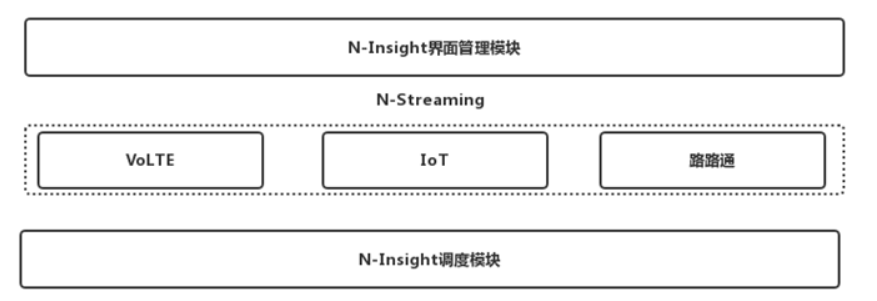
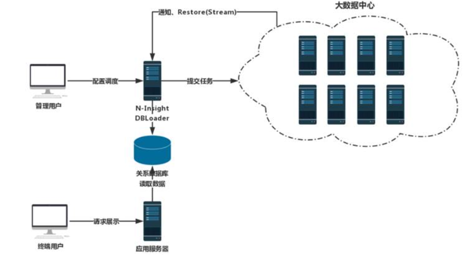

# N-Streaming系统安装手册

# 1.  文档说明

## 1.1  阅读对象

本手册是N-Streaming系统的安装手册。它指导读者如何正确对N-Streaming系统进行安装，平台数据进行配置，以及使用过程中的注意事项。

本手册面向的主要对象是N-Streaming系统管理员及维护人员。也可以为N-Streaming系统的安装调试工程师提供指导。

## 1.2  缩略语

| 术语 | 解释 |
| ---- | ---- |
|      |      |
|      |      |

 

 

## 1.3  文档组织结构

第一章（即本章）对本文档的阅读对象、缩略语以及文档组织结构进行了说明。

第二章介绍了系统的结构、拓扑以及安装的基本顺序。

第三章对本系统的运行环境进行了详细的阐述。

第四章详细的阐述了系统的安装步骤以及参数配置过程。

# 2.  系统介绍

## 2.1  系统构成

VoLTE项目标准版有两个版本：Spark大数据版、KPI的java版本。有单接口、多接口、CSFB、分片时延和落地方案共5个子模块。按照时间维度有15分钟级、小时级、天级、周级。目前已在河南移动(大数据版)、福建移动(KPI版)、北京移动(KPI版)项目部署。

IoT项目根据2/4G XDR接口数据过滤出IoT相关数据，对过滤后的数据进行指标计算并展示。过滤规则根据项目上的数据Apn的数据整理出非IoT的Apn作为黑名单，然后再使用黑名单对原始数据进行过滤，对过滤出的IoT数据进行相关的计算。目前已在安徽电信、江苏移动、浙江移动(未果)、上海移动、河北移动部署。

路路通项目是截至目前算法最复杂的一个项目。主要是针对http和mme XDR数据对城市道路、高速公路及高速铁路沿线的用户、小区进行计算。对用户进行感知计算，对小区进行模拟路测。目前已在浙江移动、北京移动部署。

## 2.2    拓朴结构

由于N-Streaming基于N-Insight运行，拓朴结构和N-Insight一致。

## 2.3    软件部署

N-Streaming基于N-Insight运行，部署N-Streaming之前必须完成N-Insight部署。

## 2.4    安装包介绍

N-Streaming安装包主要包涵三种类型：项目数据适配模块、指标计算模块、N-Insight Web列表模块。

- **项目数据适配模块**：指标计算模块完成后会部署到不同省份，每个省份对集团的xdr规范执行程度及xdr规范版本不一致，甚至同一个N-Streaming项目会部署到不同的运营商。项目数据适配模块的作用就是把不同运营商、不同xdr版本的数据进行格式化。把不同的xdr数据转换后的标准数据输出给指标计算模块。该模块的名称com.nsn.datamining.support.xdr.(xdr运营商).(N-Streadming名称).(项目所在地)，如河南移动VoLTE项目名称则为：com.nsn.datamining.support.xdr.normal.volte.hncmcc。该模块在每个项目上需要独立开发。
- **指标计算模块：**指标计算模块是N-Streaming的核心模块，主要用来实现算法。对于相同集团规范版本的xdr可以通过适配模块解决，但不同xdr版本的字段数量和指标均有不同。所以在指标计算模块需要针对不同版本的xdr分开开发，通过配置的方式对不同的xdr版本使用对应的开发版本。该模块的名称格式：com.nsn.do.tbox.spark.(子模块称称).(时间维度)，如VoLTE项目的VoLTE模块小时维度则为：com.nsn.do.tbox.spark.volte.hour。
- **N-Insight Web列表模块**：该模块主要用于把N-Streaming相关功能注册到N-Insight。能够进一步在N-Insight中展示功能列表并进行调度。该模块的名称格式：com.nsn.web.do.tbox.spark.(子模块乐称).(时间维度)，如VoLTE项目的VoLTE模块小时维度则为：com.nsn.web.do.tbox.spark.volte.hour。

 

## 2.5    安装次序概述

N-Streaming必须运行在N-Insight基础之上，安装 N-Streaming之前须保证已完成N-Insight的安装。

# 3.  运行环境

## 3.1  应用服务器

​        N-Streaming所使用的应用服务器是N-Insight的jetty应用服务器插件，不需要独立安装应用服务器。

## 3.2  数据库服务器

​        N-Streaming使用N-Insight的数据库服务器，无需独立安装数据库服务器。

# 4.  系统安装

## 4.1  安装准备

需要提前将项目所需要jar包打包好，以VoLTE项目为例需要以下插件包：

**项目适配模块**：com.nsn.datamining.support.xdr.normal.volte.hncmcc.jar

**指标计算模块**：

- com.nsn.do.tbox.spark.csfb.hour.jar

- com.nsn.do.tbox.spark.volte.hour.jar

- com.nsn.do.tbox.spark.methodology.hour.jar

**N-Insight Web列表模块**：

- com.nsn.web.do.tbox.spark.csfb.hour.jar

- com.nsn.web.do.tbox.spark.volte.hour.jar

- com.nsn.web.do.tbox.spark.methodology.hour.jar

## 4.2  数据库安装空间建立

 N-Streaming无需建立表空间。

## 4.3  核心业务VoLTE子系统的安装

由于N-Streaming安装较为简单，且N-Streaming模块会持续增加，本文档暂以VoLTE为例进行安装，其他N-Streaming可以参考VoLTE进行安装。

### **4.3.1**  **软件安装**

把在4.1章节所准备的的jar包直接上传或拷贝到工具条的plugins目录即可。如Toolbox/plugins。 