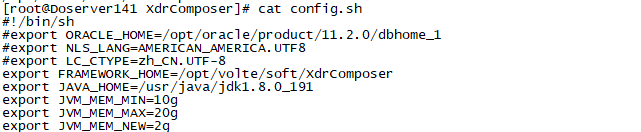
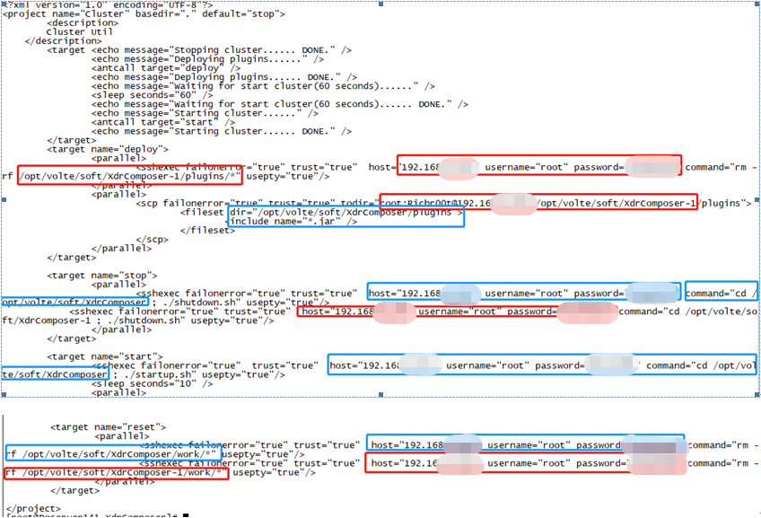
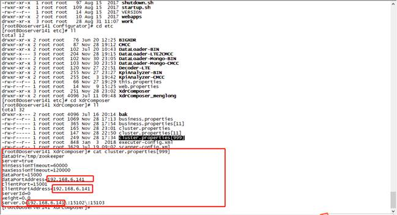
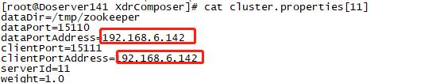
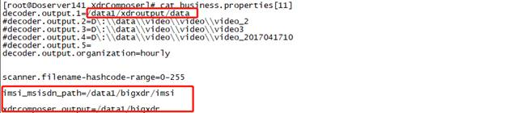
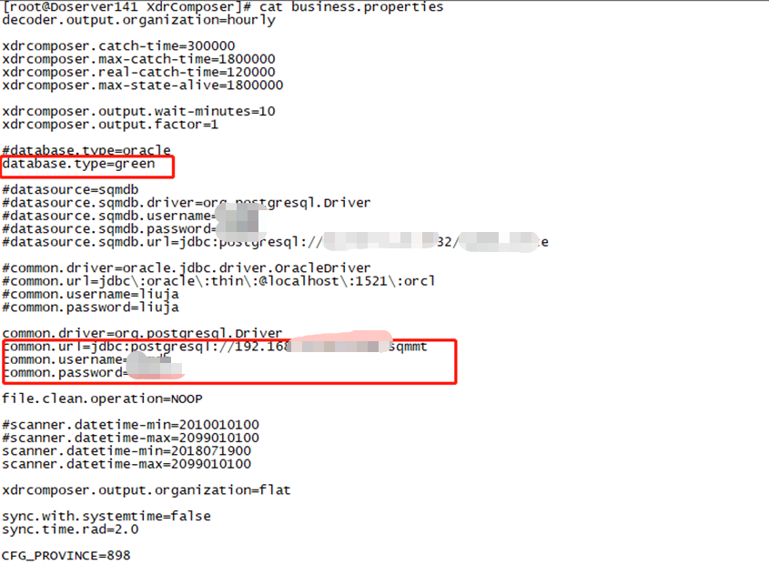
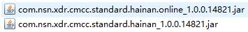

# N-Insight系统安装手册

# 1.  文档说明

## 1.1  阅读对象

本手册是XdrComposer合成系统的安装手册。它指导读者如何正确对XdrComposer系统进行安装，平台数据进行配置，以及使用过程中的注意事项。

本手册面向的主要对象是XdrComposer合成系统管理员及维护人员。也可以为XdrComposer合成系统的安装调试工程师提供指导。

## 1.2  缩略语

| 术语         | 解释                              |
| ------------ | --------------------------------- |
| JDK       | Java运行环境                    |
| GP        | GreenPlum数据库 |
| ANT        | Apache-ant     |


## 1.3  文档组织结构

第一章（即本章）对本文档的阅读对象、缩略语以及文档组织结构进行了说明。

第二章介绍了系统的结构、拓扑以及运行环境。

第三章对本系统的使用进行了详细的阐述。

第四章对详细的阐述了系统的安装步骤以及参数配置过程。

第五章说明了系统的启动和停止功能。

第六章附录

## 1.4  使用说明

本章讲述了XdrComposer系统的使用说明。

【注意】的意思是请读者注意的一些事项。

【警告】的意思是请读者千万注意某些事项，否则将造成错误。

# 2.  系统介绍

## 2.1  系统构成

DO-Volte是诺基亚通信基于通过数据业务智能分析解决方案,该系统通过DO系统采集的全网24*7小时接口与用户行为相关的信令及特征信息，建立基础数据库，根据网维、网优、数业、市场等各部门在调研中的具体需求课题，分析、归纳出用户使用数据业务的行为规律和特点，为运营商的市场部门数据业务分析及推广以及网络部门数据业务评估、维护及优化分析建议及数据支撑：
•	分析移动数据业务质量，了解用户使用情况，评估用户感受
•	为公司市场营销部门挖掘各项业务推广的精确用户群
•	分析受用户欢迎的手机数据业务，为完善公司数据业务内容及市场推广提供建议
•	分析用户行为与业务收入，评估数据业务收入贡献，为提高数据业务收入提供建议
•	为市场及数业部门提供其它相关分析数据，支持数据业务营销

XdrComposer合成是其中不可缺少的数据处理层，用于多个接口数据合并成一条完整的业务数据，以供上层业务建模和开发。
如下图2-1中标红即XdrComposer在架构图中的位置


图2-1 DO  VOLTE系统架构图


图2-2 XdrComposer数据流图


## 2.2    运行环境


图2-3 XdrComposer网络拓扑图

## 2.3    软件部署

将以下所有安装的软件统一安装到指定目录，创建指定目录如下所示：

```shell
mkdir /opt/do   
```

注：该平台所有安装的软件都安装在/opt/do

### 2.3.1    安装包介绍

XdrComposer主要包括以下几部分：

- **JDK**： Java运行环境。
- **ANT**： Apache-ant。
- **Configurator**： 配置中心，提供配置参数。
- **DataLoader-LTE2CMCC**：将BIN文件转化CSV,包括字段回填。
- **DB关系库**：GP或Oracle数据库，需要安装GP或Oracle的客户端。
- **XdrComposer**：XdrComposer合成安装包。

### 2.3.2    安装次序概述

- **JDK1.8安装** 详见JAVA运行环境安装
- **ANT安装** 详见ANT安装
- **安装Configurator** 详见配置中心部署文档
- **DataLoader-LTE2CMCC**： 详见DataLoader-LTE2CMCC部署文档
- **XdrComposer安装**：XdrComposer安装。


# 3.  系统安装

### 3.1.1 JDK1.8安装完成
### 3.1.2 Apache-ant安装完成
### 3.1.3 Configurator软件安装完毕
  安装可参考Configurator安装手册
### 3.1.4 DataLoader-LTE2CMCC软件安装完毕
  合成的数据源是CSV文件，DataLoader-LTE2CMCC将解码器输出的BIN文件转化成CSV，同时会做一些数据的回填

  安装可参考DataLoader-LTE2CMCC部署安装手册

### 3.1.5 数据库验证
  首先，确保如下sql可正常执行，且有数据可查出，否则不具备部署XdrComposer条件：
  >select t.para_name,t.default_value from tas_master.cfg_composer_para t;--合成参数配置表

  >select t.ne_name as "NE_NAME",t.ne_ip as "NE_IP",t.ne_ipn as "NE_IPN",t.ne_type as "NE_TYPE",t.ne_sub_type as "NE_NET_TYPE" from tas_master.v_cfg_ipconf t;--网元配置表

  >select t.tac as "TAC",t.brand as "BRAND",t.model as "MODEL",t.category as "CATEGORY",t.os as "OS" from tas_master.cfg_tac t;--TAC表

  其次，如果项目中包含CSFB合成，则还需要保证如下sql正常执行，且有数据可查出
  >select t.no as "NE_CODE",t.area as "AREA",t.mss_name as "NE_NAME",t.na1_spc as "NA1_SPC" from tas_master.cfg_2g_na1spc t;-- 2G小区表 如果不需要CSFB则不需要该表

## 3.2 XdrComposer安装
XdrComposer不再支持单机部署，必须集群安装。

集群部署时，节点按功能区分为：控制节点、处理节点（读节点）、数据节点（写节点）

如何区分，详见4.2.6中的配置说明中标黄地方

### 3.2.1	修改程序运行环境配置文件
#### 3.2.1.1 修改config.sh
文件路径：../XdrComposer{-CN}/config.sh


配置项的具体含义如下

| FRAMEWORK_HOME | 当前节点部署路径                                             |
| -------------- | ------------------------------------------------------------ |
| JAVA_HOME      | JAVA安装目录                                                 |
| JVM_MEM_MIN    | 最小内存    除控制节点外统一配置64G（调优除外）    控制节点配置2G |
| JVM_MEM_MAX    | 最大内存    除控制节点外统一配置64G（调优除外）    控制节点配置2G |
| JVM_MEM_NEW    | 年轻代内存    除控制节点外统一配置32G（调优除外）    控制节点配置1G |


#### 3.2.1.2	修改this.properties
文件路径./XdrComposer{-CN}/etc/this.properties


#### 3.2.1.3	修改cluster.xml
文件路径./XdrComposer{-CN}/cluster.xml


标注为蓝色对应集群的控制节点，红色对应处理节点，按照实际部署的IP、用户名密码、路径进行修改。cluster.xml只需要在控制节点里进行修改，处理节点不用关心。部署的时候直接将整个XdrComposer目录拷贝一份出来作为处理节点即可。若需配置多个处理节点，则需要在cluster.xml文件里添加相关配置。参考上面截图中红色部分

#### 3.2.1.4	修改配置中心
文件路径./Configurator/etc/XdrComposer/

- 集群控制节点和处理节点具体怎么分配，主要取决于配置中心中的cluster.properties[id]和business.properties[id]的具体内容。
- 修改cluster.properties[999]，此时weigth=0，且没有配置server为true，说明该cluster.properties[999]对应控制节点，999和控制节点this.properties中的id对应。此时应将文件中的IP替换为控制节点所在机器IP。



[注意]
- 程序启动后会去读取配置中心的cluster.properties[id]的内容，只有当cluster.properties[id]内容中设置了server=true且weigth=0.0的才处理为控制节点，如果cluster.properties[id]内容中没有设置server=true，则server默认为false，说明该节点为处理节点。
- 一套集群环境中只能有一个控制节点，可以设置多个处理节点。修改cluster.properties[11]，将文件中的IP替换为处理节点所在机器IP。此时cluster.properties[11]中weigth>0，且没有配置server为true，说明该节点为处理节点，11和处理节点this.properties中的id对应



-	修改business.properties[11]，修改文件中的输入数据源路径和输出数据的路径。此处decoder.output.1指向DataLoader-LTE2CMCC的输出目录。xdrcomposer.output指向xdrcomposer的数据输出目录。



【注意】
只要business.properties[id]文件内容中包含了decoder的文件输出路径，就代表该节点是处理节点，此时business.properties[11]就代表了处理节点，11对应处理节点中this.properties中的id。集群环境可以配置一个控制节点和多个处理节点。多个处理节点，建议decoder文件数据目录配置相同，而使用scanner.filename-hashcode-range=0-255来分文件由谁处理，0-255表示全部



配置文件加载时，先读取不带数字的，然后读取带数字的配置文件来更新，此处因为控制节点没有带数字的配置文件，所以采用该默认配置business.properties。另外因为合成需要用到配置表，比如说网元配置表，所以business.properties也需要配置GP库的访问信息。


#### 3.2.1.5	检查插件包适配

XdrComposer/plugins需要放入适配当前项目的插件包，比如海南的xdr数据合成就需要放入海南的插件包：



放入后请检查是否有和其他项目的插件包冲突。

同时将适配提供的Xdr.def放在配置中心/etc/CMCC/目录下

#### 3.2.1.6	**参数配置**

business.properties配置详细参数

| 参数                            | 默认值                | 说明                                                         |
| ------------------------------- | --------------------- | ------------------------------------------------------------ |
| decoder.output.organization     | flat                  | 解码器输出目录类型    hourly：小时目录    flat：非小时目录   |
| decoder.output.{num}            |                       | 解码器输出目录    num取值1-30，目前支持最大30个目录    配置了该项，则表明当前节点可以读取文件，即所谓的处理节点（读节点） |
| scanner.filename-hashcode-range | 0-255                 | 节点读取文件的比例    将文件分成256份，配置0-255，表示全量读取    配置2-127，表示读取一半 |
| file.clean.operation            | NOOP                  | 是否清除解码器文件：    NOOP：不做任何处理    DELETE:删除文件 |
| scanner.datetime-min            | 2010010100            | 最小处理文件时间                                             |
| scanner.datetime-max            | 2099010100            | 最大处理文件时间                                             |
| database.type                   | oracle                | 数据库类型    目前仅支持oracle和GP    oracle：Oracle    green：GP库 |
| common.driver                   |                       | oracle.jdbc.driver.OracleDriver    或    org.postgresql.Driver |
| common.url                      |                       | 数据库实例                                                   |
| common.username                 |                       | 数据库用户名                                                 |
| common.password                 |                       | 数据库密码                                                   |
| xdrcomposer.output              |                       | 合成输出目录                                                 |
| xdrcomposer.output.organization | flat                  | 合成输出目录类型    hourly：小时目录，可以自动创建小时目录    flat：非小时目录 |
| imsi_msisdn_path                |                       | IMSI和MSISDN映射关系保存目录                                 |
| xdrcomposer.catch-time          | 300000                | 合成缓存时间，单位：ms                                       |
| xdrcomposer.max-catch-time      | 3600000               | 最大换程缓存时间，单位：ms                                   |
| xdrcomposer.max-state-alive     | 3600000               | 最大保存时间，单位：ms                                       |
| xdrcomposer.real-catch-time     | 120000                | 真实缓存时间，单位：ms                                       |
| xdrcomposer.output.wait-minutes | 10                    | 输出时间窗口，单位：分钟                                     |
| xdrcomposer.output.line-limit   | 1000000               | 文件最多支持多少行，单位：行   以下三个参数满足任何一个则输出   xdrcomposer.output.line-limit   xdrcomposer.output.size-limit xdrcomposer.output.time-limit |
| xdrcomposer.output.size-limit   | 128*1024*1024（128M） | 文件最大支持多大容量，单位：byte                             |
| xdrcomposer.output.time-limit   | 5*60*1000（5分钟）    | 文件缓存等待时间，单位：ms                                   |
| xdrcomposer.output.factor       | 1                     | 支持并发写几个文件，单位：个                                 |
| CFG_PROVINCE                    | 898                   | 项目省份代码：    默认898，海南                              |

cluster.properties详细参数配置


| 参数              | 默认值                  | 说明                                                         |
| ----------------- | ----------------------- | ------------------------------------------------------------ |
| tickTime          | 2000                    |                                                              |
| initLimit         | 10                      |                                                              |
| syncLimit         | 30                      |                                                              |
| minSessionTimeout | 60000                   |                                                              |
| maxSessionTimeout | 120000                  |                                                              |
| dataDir           |                         | zookeeper临时节点目录                                        |
| dataPort          | 15000                   |                                                              |
| dataPortAddress   | 127.0.0.1               | ip地址                                                       |
| clientPort        | 15001                   |                                                              |
| clientPortAddress | 127.0.0.1               |                                                              |
| serverId          | 1                       | 是否控制节点：    1：控制节点    0：非控制节点               |
| weight            | 1                       | 可支持小数    >0表示该节点是数据节点（输出节点）    处理文件比重为=weight/sum（weight） |
| server.1          | localhost\:15102\:15103 | 控制节点ip和端口                                             |
| server.2          | localhost\:15202\:15203 | 控制节点备用ip和端口                                         |
| server.3          | localhost\:15302\:15303 | 控制节点备用ip和端口                                         |


# 4.	系统的启动停止
## 4.1	业务系统的启动
进入控制节点

  运行sh cluster.sh restart

或者

  sh cluster.sh stop

  sh cluster.sh deploy

  sh cluster.sh start

  运行前建议将work目录和felix-cache目录中内容清空

注意：程序执行完成后，还需要将XdrComposer/TODO目录下的tabledefinition.txt拷贝到配置中心/Configurator/etc/BIGXDR下。

## 4.2	业务系统的停止
  进入控制节点

  运行sh cluster.sh stop
