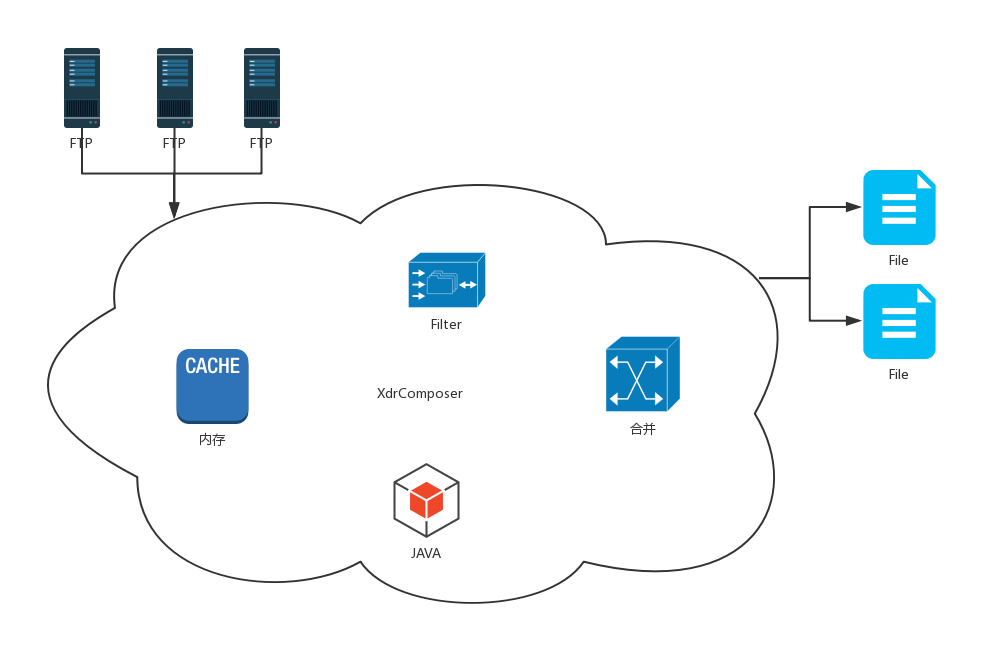

# N-Insight系统安装手册

# 1.  文档说明

## 1.1  阅读对象

本手册是XdrComposer合成系统的安装手册。它指导读者如何正确对XdrComposer系统进行安装，平台数据进行配置，以及使用过程中的注意事项。

本手册面向的主要对象是XdrComposer合成系统管理员及维护人员。也可以为XdrComposer合成系统的安装调试工程师提供指导。

## 1.2  缩略语

| 术语         | 解释                              |
| ------------ | --------------------------------- |
| JDK       | Java运行环境                    |
| GP        | GreenPlum数据库 |
| ANT        | Apache-ant     |


## 1.3  文档组织结构

第一章（即本章）对本文档的阅读对象、缩略语以及文档组织结构进行了说明。

第二章介绍了系统的结构、拓扑以及运行环境。

第三章对本系统的使用进行了详细的阐述。

第四章对详细的阐述了系统的安装步骤以及参数配置过程。

第五章说明了系统的启动和停止功能。

第六章附录

## 1.4  使用说明

本章讲述了XdrComposer系统的使用说明。

【注意】的意思是请读者注意的一些事项。

【警告】的意思是请读者千万注意某些事项，否则将造成错误。

# 2.  系统介绍

## 2.1  系统构成

DO-Volte是诺基亚通信基于通过数据业务智能分析解决方案,该系统通过DO系统采集的全网24*7小时接口与用户行为相关的信令及特征信息，建立基础数据库，根据网维、网优、数业、市场等各部门在调研中的具体需求课题，分析、归纳出用户使用数据业务的行为规律和特点，为运营商的市场部门数据业务分析及推广以及网络部门数据业务评估、维护及优化分析建议及数据支撑：
•	分析移动数据业务质量，了解用户使用情况，评估用户感受
•	为公司市场营销部门挖掘各项业务推广的精确用户群
•	分析受用户欢迎的手机数据业务，为完善公司数据业务内容及市场推广提供建议
•	分析用户行为与业务收入，评估数据业务收入贡献，为提高数据业务收入提供建议
•	为市场及数业部门提供其它相关分析数据，支持数据业务营销

XdrComposer合成是其中不可缺少的数据处理层，用于多个接口数据合并成一条完整的业务数据，以供上层业务建模和开发。
如下图2-1中标红即XdrComposer在架构图中的位置


图2-1 DO  VOLTE系统架构图


图2-2 XdrComposer数据流图


## 2.2    拓朴结构



图2-3 XdrComposer网络拓扑图

## 2.3    软件部署

将以下所有安装的软件统一安装到指定目录，创建指定目录如下所示：

```shell
mkdir /opt/do   
```

注：该平台所有安装的软件都安装在/opt/do


## 2.4    安装包介绍

N-Insight安装主要包括以下几部分：

- **Postgres数据库**：用于存放N-Insight计划任务、专题、执行结果等相关数据。
- **配置中心：**为N-Insight提供web方式的配置参数。
- **N-Insight**：调度N-Streaming的插件集合。
- **大数据客户端**：用于调hdfs/hive数据及提交Spark任务。
- **指标数据库客户端：**如果结果指标数据使用GP或Oracle数据库，需要安装GP或Oracle的客户端。

# 3.  系统安装

## 3.1  Postgres数据库

### 3.1.1    修改配置文件

#### 3.1.1.1    postgresql.conf

使用vi编辑postgresql.conf：

```shell
vi  /var/lib/pgsql/10/data/postgresql.conf
```

配置信息如下所示，主要修改配置文件中listen_addresses这一属性，这个属性用来限制可以访问postgre数据库的主机，默认为localhost(表示数据库只能接受本地的客户端连接请求，不能接受远程的客户端连接请求)，需要修改为(所有客户端均可访问)或n06(也可以是ip地址，多个地址需要逗号分隔)，把listen_addresses前面的注释去掉，并修改值为:listen_addresses = '*'


修改后保存退出（:wq）

#### 3.1.1.2    pg_hba.conf

使用vi编辑主机名：

```shell
vi  /var/lib/pgsql/10/data/pg_hba.conf
```

TYPE定义了多种连接PostgreSQL的方式，一般分为：

- loca使用本地unix套接字
- host使用TCP/IP连接（包括SSL和非SSL），host结合IPv4地址/结合IPv6地址
- hostssl只能使用SSL TCP/IP连接
- hostnossl不能使用SSL TCP/IP连接

METHOD为身份验证模式一般分为：ident、trust、md5、password、peer、reject。其中ident和peer模式仅适用于Linux、Unix和Max，不适用于Windows。

- trust该模式可以不用密码直接连接数据库，不安全
- md5该模式很常用，要求连接发起者携带用md5算法加密的密码
- password该模式是使用明文密码进行身份验证，也不安全，不推荐
- ident该模式下系统会将请求发起者的操作系统用户映射为PostgesSQL数据库内部用户，并以该内部用户的权限登录，且此时无需提供登录密码。操作系统用户与数据库内部用户之间的映射关系会记录在pg_ident.conf文件中。
- peer该模式使用连接发起端的操作系统名进行身份验证。仅限于Linux、BSD、Mac OS X和Solaris，并且仅可用于本地服务器发起的连接。
- reject该模式表示拒绝所有请求。

多种身份验证模式可以同时使用，即使是针对同一个数据库。对于每一个连接请求，postgres服务器会按照pg_hba.conf文件中记录的规则条目自上而下进行检查。当匹配到第一条满足条件的规则，就不再向下检查。如果到文件末尾都没有搜到匹配的规则，那么按默认规则处理，即拒绝该链接。本次需要添加下以配置：

```shell
host all   all   192.168.168.0/32   md5
```


修改后保存退出（:wq）

#### 3.1.1.3    重新启动postgre服务

重新启动postgre：

```shell
systemctl restart postgresql-10.service
```

添加开机启动：

```shell
systemctl enable postgresql-10.service
```


### 3.1.2    初始化N-Insight库表

（1）  把N-Insight初始化脚本上传到n05/opt/do

（2）切换到postgres用户

```shell
su – postgres
```


（3）运行psql客户端


（4）导入初始化脚本

```sql
\i /opt/do/toolbox-postgres-init.sql
```

## 3.2  配置中心

### 3.2.1  配置中心(Configurator)的作用

DO项目由多个子应用组成，并且应用还需要集群化，每台机器上需要运行多个合成应用。每个应用都有一些参数需要配置，如果把每个应用的参数配置到应用中，参数会碎片化，不方便管理。配置中心(Configurator)主要目的是为了把所有应用的配置参数集中化管理。

### 3.2.2  解压安装包

进入安装目录，命令如下：

```shell
cd  /opt/do

ls -al
```


解压Configurator安装包，命令如下所示：

```shell
tar  -xvf  Configurator.tar
```


### 3.2.3  配置N-Insight参数

#### 3.2.3.1  配置数据源

数据源主要作用：计算引擎、存储中间数据、存储计算结果。不同功能的数据源类型不一样，注册一种数据源首先需要先在datasources中注册，如果有多个数据源使用逗号分隔，如下示例：

```properties
datasources=spark1, mysql1
```

数据源注册后，需要再详细描述详细的配置参数，每个参数名必须存在，如果某个参数不需要设置，则置为空。N-Insight中主要有以下几种数据源：

#### 3.2.3.2  Spark数据源

Spark数据源作为计算引擎，需要以下参数：

```properties
spark1.source-type=XDR-CMCC-SPARK

spark1.type=XDR-CMCC-SPARK

spark1.title=CMDI Hadoop ENV

spark1.arg.home=/opt/do/spark-2.2.0

spark1.arg.configuration=/opt/do/spark-2.2.0/conf1

spark1.arg.name=Toolbox-nokia

spark1.arg.hivedb=result

spark1.arg.hdfs=hdfs://bjmcc-hdp-cluster-node-06.do:8020/output/

spark1.arg.staging=hdfs://vm73:8020/user/hdfs/.sparkStaging/

spark1.arg.hiveSetting=mapred.input.dir.recursive=true
```

- spark1.source-type和spark1.type：为数据源的类型，执行计划中类型相同的数据源将作为列表中的待选项。
- spark1.title：数据源标题，作为执行计划中数据源列表中的显示内容.
- spark1.arg.home：spark计算引擎在N-Insight所在机器上的位置。
- spark1.arg.configuration：spark配置文件在N-Insight的所在位置。
- spark1.arg.name：数据源名称
- spark1.arg.hivedb：spark计算的中间结果存放在hive中的库名，中间结果主要用于不同粒度的计算。如小时粒度的数据作为中间结果存放到hive中，天粒度的计算无需读取全天的源数据，直接读取全天小时粒度的中间结果计算出天粒度的数据。这样能大幅度减小输入的数据，提高运行效率。
- spark1.arg.hdfs：中间结果目录。与hive不同的是hdfs目录主要用于缓存数据，作用于本次计算，本次计算完成的可以清理。
- spark1.arg.staging：spark提交运行后存放jar包和配置文件的目录，主要用于同步standalong和yarn模式下的jar包和配置数据同步。不常用。
- spark1.arg.hiveSetting：云平台比较个性的hive参数，用于创建sparkSession时加载。不常用。

#### 3.2.3.3  关系库数据源

关系库数据源的作用有两种：一是从关系库中读取一些参数数据表，数据量不能太大。二是把计算引擎中的计算结果输出到关系库，供界面展示。下面以Mysql为例，关系库数据源参数样例如下：

```properties
mysql1.source-type=MYSQL-NORMAL

mysql1.type=MYSQL-NORMAL

mysql1.title=CMDI MySQL

mysql1.arg.host=10.254.201.233

mysql1.arg.port=3306

mysql1.arg.database=volte

mysql1.arg.username=********

mysql1.arg.password=********

mysql1.arg.data_dir=/opt/do/Toolbox/data

mysql1.arg.charset=utf-8
```

-   mysql1.source-type和mysql1.type：数据源的类型，作为输入数据源时可以执行计划中类型相同的数据源将作为列表中的待选项。
-   mysql1.title：数据源标题，执行计划中数据源列表中的显示内容。仅作为输入数据源时使用，作为输出数据源时可置空。
-   mysql1.arg.host：关系数据库所在主机地址。
-   mysql1.arg.port：关系数据库使用的端口。
-   mysql1.arg.database：所使用的库名。
-   mysql1.arg.username和mysql1.arg.password：数据库的用户名和密码。
-   mysql1.arg.data_dir：存放计算结果临时目录。最终的计算结果会先存放到hdfs上，再从hdfs上以流的方式拉取到N-Insight所在主机中的临时目录，再从临时目录导入到关系库中。
-   mysql1.arg.charset：建立数据库连接时的编码，主要为解决中文乱码。

#### 3.2.3.4  设置本项目的数据源

编辑数据源配置文件，命令如下：

```shell
cd  /opt/do/Configurator/etc/Toolbox

ls -al
```


用vi编辑datasource.properties文件，命令如下：

```shell
vi  datasource.properties
```

需要配置spark计算资源和mysql计算结果数据库以及本地的spark提交命令和N-Insight的callback地址。


修改完成后保存退出(:wq)

-  runtime.spark.submit：提交spark任务的脚本位置。
-  datamining.callback：spark任务执行完成后的回调地址。回调地址主要把计算结果入到关系库及向消息中心中发送消息。


### 3.2.4  配置N-Insight数据库

用vi编辑system.properties文件，命令如下：

```shell
vi  /opt/do/Configurator/etc/Toolbox/system.properties
```

把3.1.2章节初始化的数据库信息及连接相关配置更新到system.properties


修改完成后保存退出(:wq)

该库是运行N-Insight的基础库，主要用于存放N-Insight的认证、执行计划、执行结果等数据。

-   system.jdbc.type：数据库的类型，green(postgres数据库)或oracle(oracle数据库)。
-   system.jdbc.driver：数据库的驱动程序类。
-   system.jdbc.url：连接数据库的url。
-   system.jdbc.username：数据库的用户名。
-   system.jdbc.password：数据库的密码。
-   system.jdbc.maxActive：连接池中最大的连接个数。
-   system.jdbc.minIdle：连接池中最小空闲连接数。
-   system.jdbc.initialSize：连接池中初始化连接数。

### 3.2.5  启动配置中心

#### 3.2.5.1    设置配置中心端口

进入Configurator的配置目录，查看配置中心默认端口：

```shell
cd  /opt/do/Configurator/etc/

cat web.properties
```


确认默认端口在本机是否被占用，命令如下所示：

```shell
telnet n05 8899
```

Connection refused表示该端口没有被占用


#### 3.2.5.2    执行启动脚本

执行Configurator的根目录启动脚本：

```shell
/opt/do/Configurator/startup.sh
```

下面代表配置中心启动成功


## 3.3  N-Insight安装

### 3.3.1    解压N-Insight安装包

进入安装目录并执行解压命令，命令如下：

```shell
cd /opt/do

tar -xvf Toolbox.tar
```

### 3.3.2    修改配置

在N-Insight目录下进入配置文件目录，编辑this.properties文件：

```shell
cd Toolbox/etc

vi this.properties
```

把配置路径指向配置中心：


### 3.3.3    启动N-Insight

进入N-Insight根目录，执行启动脚本，命令如下：

```shell
cd /opt/do/Toolbox

./startup.sh
```


## 3.4  大数据客户端

大数据客户端需要Hadoop集群平台运维人员安装。
