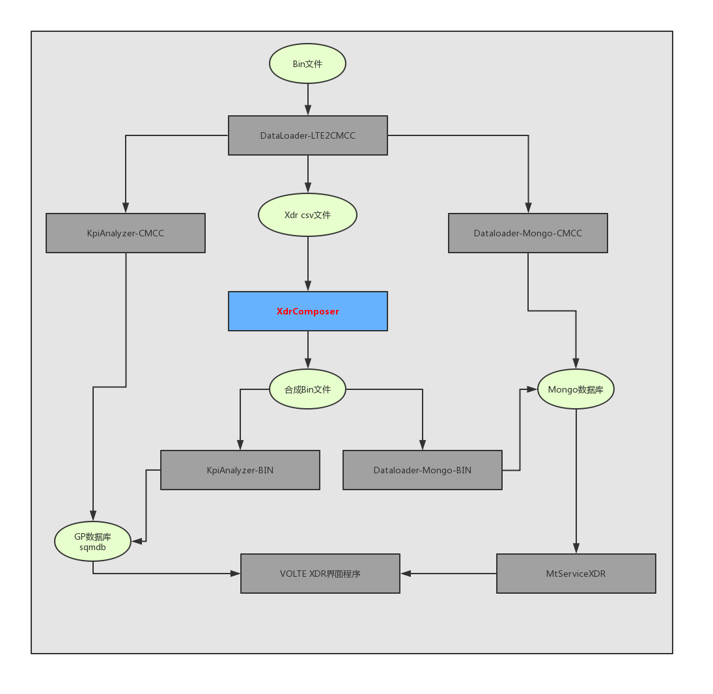
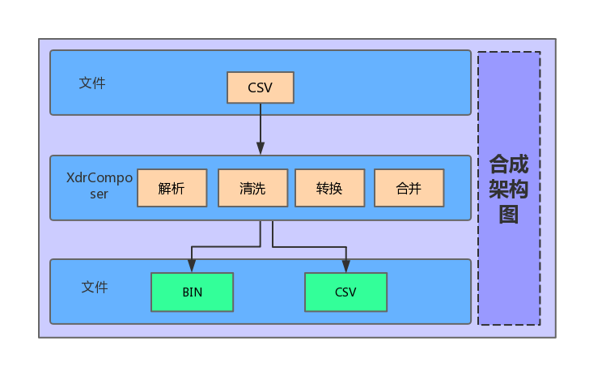
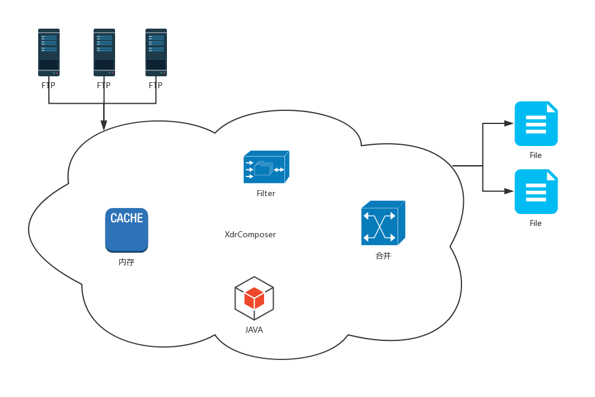

# XdrComposer系统用户手册

# 1.  文档说明

## 1.1  阅读对象

本手册是XdrComposer合成系统的安装手册。它指导读者如何正确对XdrComposer系统进行安装，平台数据进行配置，以及使用过程中的注意事项。

本手册面向的主要对象是XdrComposer合成系统管理员及维护人员。也可以为XdrComposer合成系统的安装调试工程师提供指导。

## 1.2  缩略语
| 术语         | 解释                              |
| ------------ | --------------------------------- |
| JDK       | Java运行环境                    |
| GP        | GreenPlum数据库 |
| ANT        | Apache-ant     |

## 1.3  文档组织结构

第一章（即本章）对本文档的阅读对象、缩略语以及文档组织结构进行了说明。

第二章介绍了系统的结构、拓扑以及运行环境。

第三章对本系统的使用进行了详细的阐述。

第四章对详细的阐述了系统的安装步骤以及参数配置过程。

第五章说明了系统的启动和停止功能。

第六章附录

## 1.4  使用说明

本章讲述了XdrComposer系统的使用说明。

【注意】的意思是请读者注意的一些事项。

【警告】的意思是请读者千万注意某些事项，否则将造成错误。

# 2.  系统简介

## 2.1  系统构成
DO-Volte是诺基亚通信基于通过数据业务智能分析解决方案,该系统通过DO系统采集的全网24*7小时接口与用户行为相关的信令及特征信息，建立基础数据库，根据网维、网优、数业、市场等各部门在调研中的具体需求课题，分析、归纳出用户使用数据业务的行为规律和特点，为运营商的市场部门数据业务分析及推广以及网络部门数据业务评估、维护及优化分析建议及数据支撑：
•	分析移动数据业务质量，了解用户使用情况，评估用户感受
•	为公司市场营销部门挖掘各项业务推广的精确用户群
•	分析受用户欢迎的手机数据业务，为完善公司数据业务内容及市场推广提供建议
•	分析用户行为与业务收入，评估数据业务收入贡献，为提高数据业务收入提供建议
•	为市场及数业部门提供其它相关分析数据，支持数据业务营销

XdrComposer合成是其中不可缺少的数据处理层，用于多个接口数据合并成一条完整的业务数据，以供上层业务建模和开发。
如下图2-1中标红即XdrComposer在架构图中的位置

图2-1 DO  VOLTE系统架构图

图2-2 XdrComposer数据流图

## 2.2  运行环境

图2-3 XdrComposer网络拓扑图

### **2.2.1**  **硬件环境**

XdrComposer合成是对大数据量单接口合并成详单输出，对服务器有一定的要求。
最低要求32G，16核CPU。
最好256G内存，48核CPU。

### **2.2.2**  **软件环境**

表 2-1 系统运行的软件环境

|软件  | 版本         | 描述                             |
| ---- | ------------ | --------------------------------- |
| OS   | Redhat6.5       | 操作系统                    |
| JDK    | JDK1.8       | Java运行环境                   |
| ANT   | Apache-ant-1.10.5 | 编译构建工具 |
| DB   | Oracle 10g或者GP | 数据库 |

# 3.  系统安装

## 3.1 安装准备

### 3.1.1 JDK1.8安装完成
### 3.1.2 Apache-ant安装完成
### 3.1.3 Configurator软件安装完毕
  安装可参考Configurator安装手册
### 3.1.4 DataLoader-LTE2CMCC软件安装完毕
  合成的数据源是CSV文件，DataLoader-LTE2CMCC将解码器输出的BIN文件转化成CSV，同时会做一些数据的回填

  安装可参考DataLoader-LTE2CMCC部署安装手册

### 3.1.5 数据库验证
  首先，确保如下sql可正常执行，且有数据可查出，否则不具备部署XdrComposer条件：
  >select t.para_name,t.default_value from tas_master.cfg_composer_para t;--合成参数配置表

  >select t.ne_name as "NE_NAME",t.ne_ip as "NE_IP",t.ne_ipn as "NE_IPN",t.ne_type as "NE_TYPE",t.ne_sub_type as "NE_NET_TYPE" from tas_master.v_cfg_ipconf t;--网元配置表

  >select t.tac as "TAC",t.brand as "BRAND",t.model as "MODEL",t.category as "CATEGORY",t.os as "OS" from tas_master.cfg_tac t;--TAC表

  其次，如果项目中包含CSFB合成，则还需要保证如下sql正常执行，且有数据可查出
  >select t.no as "NE_CODE",t.area as "AREA",t.mss_name as "NE_NAME",t.na1_spc as "NA1_SPC" from tas_master.cfg_2g_na1spc t;-- 2G小区表 如果不需要CSFB则不需要该表

## 3.2 XdrComposer安装
必须集群安装，XdrComposer不再支持单机部署。

集群部署时，节点按功能区分为：控制节点、处理节点（读节点）、数据节点（写节点）

如何区分，详见4.2.6中的配置说明中标黄地方

FRAMEWORK_HOME	当前节点部署路径
JAVA_HOME	JAVA安装目录
JVM_MEM_MIN	最小内存
除控制节点外统一配置64G（调优除外）
控制节点配置2G
JVM_MEM_MAX	最大内存
除控制节点外统一配置64G（调优除外）
控制节点配置2G
JVM_MEM_NEW	年轻代内存
除控制节点外统一配置32G（调优除外）
控制节点配置1G

#### 3.1.2 执行方式和报告消息

执行方式分为：(1)立即执行，(2)指定时间执行，(3)周期性执行，(4)按消息触发

- **立即执行**：配置好本计划之后，点击提交，本计划将会立即执行。
- **指定时间执行**：配置一个执行计划开始时间,点击提交,该执行计划会在你指定的时间开始执行。

- **周期性执行**：配置执行计划开始时间和执行计划结束时间。周期执行的重复类别分为：每1分钟，每5分钟，每10分钟，每15分钟，每30分钟，每小时，每天，每周，每月。当配置好重复类别后，该执行计划会在计划开始时间到计划结束时间这段时间内周期性执行该计划。

- **按消息触发**：如果执行计划需要依赖其他专题的执行结果(如下图所示)来判断是否触发此次专题执行计划的执行,那么就需要配置按消息触发的执行方式。

报告消息分为：(1)发送到系统队列，(2)发送到自定义队列，(3)不发送

- **发送到系统队列**：一般用于检测数据源的完整性，如在nifi入库完成后或单独开发的定时扫描插件符合条件时，向N-Insight的 消息中心发送消息，消息的地址为N-Insight所在主机及端口，例： tcp://toolbox:61616 。消息队列名称为： com.nsn.message.driver 。消息格式如下：

**event**：消息的名称。按消息运行的专题需要指定依赖消息的名称。

**start和end**：检测数据的时段。格式依数据源的粒度为准，如数据粒度为年，格式则为 yyyy ；数据粒度为月，格式 则为 yyyymm ；数据粒度为天，格式则为 yyyymmdd ；数据粒度为小时，格式则为 yyyymmddhh ；数据粒度为分钟， 格式则为 yyyymmddhhmm ；

**type**：消息的粒度。有以下几种类型： EVENT：事件消息。依赖该类型的专题收到消息后会立即执行 MINUTELY：分钟粒度。 MIN5LY：5分钟粒度。 MIN10LY：10分钟粒度。MIN30LY：30分钟粒度。 HOURLY：小时粒度。 DAYLY：天粒度。 WEEKLY：周粒度。 MONTHLY：月粒度。 YEARLY：年粒度。

- **发送到自定义队列**：和发送到系统队列一样，只是队列是自己自定义的，如果你的专题没有被其他专题所依赖，那么选择不发送。

#### 3.1.3专题参数设置

起止时间：专题执行计划要计算某个时间段内的数据

Spark执行选项：spark运行时参数列表。例如：--master yarn  --driver-memory 6g --driver-cores 2 --conf spark.sql.shuffle.partitions=30 --executor-memory 6g --executor-cores 4 --num-executors 15

专题调测：默认是不调测

### 3.2历史报告

历史报告显示的是该专题的执行计划已经执行的历史报告次数以及每次执行之后的详细信息。

例如：该计划是否执行成功，该计划的起始时间，完成时间，运行耗时等详细信息。

后面的按钮为再次执行该计划，查看该执行计划的日志，以及删除该历史执行报告。

### 3.3已有计划

已有计划表示已为该专题配置了几个执行计划，以及该执行计划的详细信息。例如：该计划的执行方式哪种,是立即执行、按指定时间执行、还是周期性执行。该计划是执行一次还是重复性执行。该计划是否向消息队列发送消息等。

立即执行：点击该按钮，该计划立即执行，参数为你所配置的spark运行时参数列表。删除为你可以删除该执行计划。
